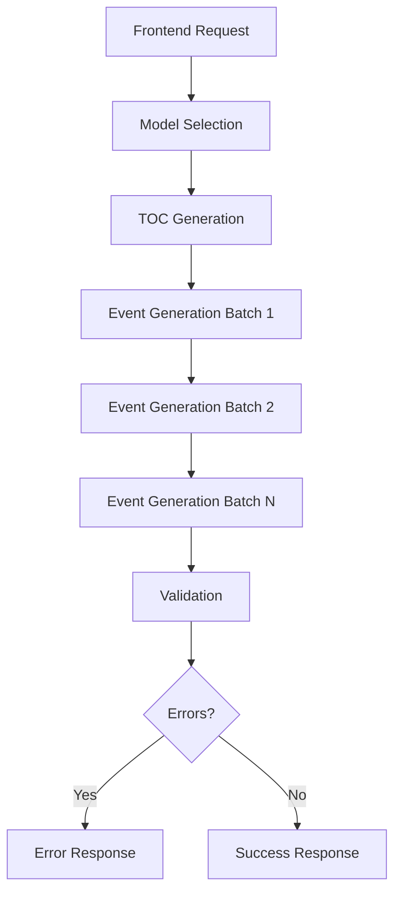

## Einführung

Das CrisisIQ Scenario Creator Backend verbindet die Frontend-Anwendung mit AI-APIs (aktuell Anthropic Claude). Das System generiert immersive Krisen-Trainings-Szenarien für KRITIS/NIS-2 Kontexte, die sowohl unterhaltsam als auch lehrreich für Trainingsprofis sind.

## Hauptverantwortlichkeiten

Das Backend ist verantwortlich für:

- **Prompt-Formulierung**: Effektive Prompts für die AI erstellen
- **API-Bereitstellung**: Saubere API für das Frontend bereitstellen
- **Logik ohne AI**: Kompilierung und Formatierung ohne AI-Anfragen
- **Kosten-/Qualitäts-Management**: Trade-offs via Modell-Auswahl

## Ziel-Parameter

Das System wurde für folgende Parameter konzipiert:

| Parameter | Wert | Hinweise |
|-----------|------|----------|
| **Max. Szenario-Größe** | 150 Events | Muss auf große Szenarien skalieren |
| **Event-Inhaltslänge** | 500-2.000 Zeichen | Flexibel, nicht starr |
| **Zeitformat** | `Tag X, HH:MM Uhr` | Streng durchgesetzt |
| **Zielgruppe** | Trainingsprofis | Domain-Wissen vorausgesetzt |
| **Primäres Modell** | Sonnet | Bestes Qualität/Kosten-Verhältnis |

## Systemkomponenten

### 1. Prompt-System

Das Prompt-System besteht aus 10 Dateien, die Prompts für verschiedene Aufgaben generieren:

#### TOC Generation (`tocPrompt.js`)
- Generiert die Story-Struktur (Events, Verzweigungen, Assessments)
- ~465 Zeilen
- Enthält komplexe Zeitregeln und Graphenmodell-Spezifikationen

#### Event Generation
- **System Prompt** (`event/systemPrompt.js`): ~397 Zeilen
  - Literarischer Stil-Guide
  - "Show don't tell" Beispiele
  - Zeichenanzahl-Vorgaben (500-2.000 Zeichen, flexibel)

- **Generate Prompt** (`event/generatePrompt.js`): ~310 Zeilen
  - Kontext-Injektion (NPC-Registry, Zeitbeschränkungen)
  - Konvergenz-Erkennung
  - Vorgänger-Inhalte

#### Regeneration (`event/regeneratePrompt.js`)
- User-Feedback-gesteuerte Umschreibungen
- ~44 Zeilen

#### Micro-Edit (`event/microEditPrompt.js`)
- Chirurgische Einzelproblem-Fixes
- ~118 Zeilen

#### Validation (`validatePrompt.js`)
- Konsistenz-Prüfung
- ~231 Zeilen
- Severity Levels und Issue-Taxonomie

#### Model Selection (`modelSelectorPrompt.js`)
- Empfiehlt Haiku/Sonnet/Opus basierend auf Komplexität
- ~86 Zeilen

### 2. Helper-Funktionen (`event/helpers.js`)

- ~331 Zeilen
- Vorgänger-Suche
- Zeit-Vergleiche
- Kontextmanagement

## Workflow

### Typischer Szenario-Generierungs-Flow

### Detaillierter Event-Generierungs-Flow

1. **TOC wird erstellt**: Struktur mit allen Events, Verzweigungen und Zeitmarkern
2. **Events werden in Batches generiert**: Typischerweise 3 Events pro API-Call
3. **Kontext wird pro Event aufgebaut**:
   - TOC-Struktur
   - Vorgänger-Events (Inhalt)
   - Formular-Daten (Industrie, Szenario-Typ, etc.)
   - NPC-Registry
4. **Validierung erfolgt nach Generierung**: Prüft Zeitkonsistenz, Inhaltqualität

## Context Window Management

### Strategie: Vollständiger Kontext

**Entscheidung**: Jeder API-Call erhält den vollständigen Kontext (formData, TOC, Previous Events).

**Rationale**:
- Event-Generierung braucht ALLE formData-Details für Konsistenz
- Keine verlustbehaftete Komprimierung von Szenario-Anforderungen
- Konsistenz über alle generierten Events hinweg

**Verworfene Alternativen**:
- ❌ **Fingerprinting**: Verliert Details, die für Konsistenz benötigt werden
- ❌ **Context Sharing**: Verliert custom System Prompts

**Token-Nutzung für große Szenarien (150 Events)**:

| Phase | System Prompt | User Prompt | Output | Total |
|-------|---------------|-------------|--------|-------|
| TOC Generation | ~8K Tokens | ~1K Tokens | ~15K Tokens | ~24K |
| Event Gen (Batch 5) | ~9K Tokens | ~8K Tokens | ~5K Tokens | ~22K |
| Validation | ~4K Tokens | ~30K Tokens | ~2K Tokens | ~36K |

**Beobachtung**: Weit innerhalb von Claudes 200K Context-Limit. Keine Optimierung nötig.

## Modell-Auswahl

### Aktuelle Strategie

Der Model Selector Prompt versucht, das optimale Modell zu wählen.

**Problem**: Model Selector selbst verursacht einen zusätzlichen API-Call.

### Empfohlene Vereinfachung (P2)

Hardcodierte Modell-Auswahl basierend auf Task-Typ:

| Task | Modell | Rationale |
|------|--------|-----------|
| **TOC** | Sonnet | Struktur + Kreativität benötigt |
| **Event** | Sonnet | Narrative Qualität kritisch |
| **Validation** | Sonnet | Reasoning benötigt |
| **Micro-Edit** | Sonnet | Kontext-Verständnis benötigt |

**Vorteil**: Spart 1 API-Call pro Generierung, konsistentere Auswahl

## Erweiterte Systeme

### Knowledge Augmentation

Domain-Expertise (KRITIS, NIS-2, Krisenprozesse) wird durch Wissensbasen in den Prompt injiziert. Selective Loading + Prompt Caching → 90% Kosteneinsparung.

### Scenario Persistence

MongoDB Atlas speichert Szenarien persistent. Auto-Save an Meilensteinen, CRUD API, Szenario-Bibliothek.

## Nächste Schritte

Für detaillierte Informationen zu spezifischen Aspekten, siehe:

- [Prompt-Architektur](/internal/prompt-architecture) - Detaillierte Analyse des Prompt-Systems
- [Knowledge Augmentation](/internal/knowledge-augmentation) - KRITIS/NIS-2 Fachwissen-Injektion
- [Best Practices](/internal/best-practices) - Implementierte Best Practices und Optimierungen
