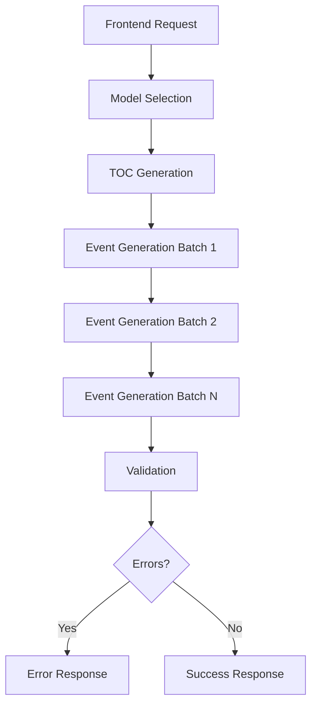

## Einführung

Das CrisisIQ Scenario Creator Backend verbindet die Frontend-Anwendung mit AI-APIs (aktuell Anthropic Claude). Das System generiert immersive Krisen-Trainings-Szenarien für KRITIS/NIS-2 Kontexte, die sowohl unterhaltsam als auch lehrreich für Trainingsprofis sind.

## Hauptverantwortlichkeiten

Das Backend ist verantwortlich für:

- **Prompt-Formulierung**: Effektive Prompts für die AI erstellen
- **API-Bereitstellung**: Saubere API für das Frontend bereitstellen
- **Logik ohne AI**: Validierung und Kompilierung ohne AI-Anfragen
- **Kosten-/Qualitäts-Management**: Trade-offs via Modell-Auswahl

## Systemkomponenten

### 1. Prompt-System

Das Prompt-System besteht aus 10 Dateien, die Prompts für verschiedene Aufgaben generieren:

#### TOC Generation (`tocPrompt.js`)
- Generiert die Story-Struktur (Events, Verzweigungen, Assessments)
- ~465 Zeilen
- Enthält komplexe Zeitregeln und Graphenmodell-Spezifikationen

#### Event Generation
- **System Prompt** (`event/systemPrompt.js`): ~397 Zeilen
  - Literarischer Stil-Guide
  - "Show don't tell" Beispiele
  - Zeichenanzahl-Vorgaben (1.800-2.000 Zeichen)

- **Generate Prompt** (`event/generatePrompt.js`): ~310 Zeilen
  - Kontext-Injektion (NPC-Registry, Zeitbeschränkungen)
  - Konvergenz-Erkennung
  - Vorgänger-Inhalte

#### Regeneration (`event/regeneratePrompt.js`)
- User-Feedback-gesteuerte Umschreibungen
- ~44 Zeilen

#### Micro-Edit (`event/microEditPrompt.js`)
- Chirurgische Einzelproblem-Fixes
- ~118 Zeilen

#### Validation (`validatePrompt.js`)
- Konsistenz-Prüfung
- ~231 Zeilen
- Severity Levels und Issue-Taxonomie

#### Model Selection (`modelSelectorPrompt.js`)
- Empfiehlt Haiku/Sonnet/Opus basierend auf Komplexität
- ~86 Zeilen

### 2. Helper-Funktionen (`event/helpers.js`)

- ~331 Zeilen
- Vorgänger-Suche
- Zeit-Vergleiche
- Kontextmanagement

## Workflow

### Typischer Szenario-Generierungs-Flow

### Detaillierter Event-Generierungs-Flow

1. **TOC wird erstellt**: Struktur mit allen Events, Verzweigungen und Zeitmarkern
2. **Events werden in Batches generiert**: Typischerweise 3 Events pro API-Call
3. **Kontext wird pro Event aufgebaut**:
   - TOC-Struktur
   - Vorgänger-Events (Inhalt)
   - Formular-Daten (Industrie, Szenario-Typ, etc.)
   - NPC-Registry
4. **Validierung erfolgt nach Generierung**: Prüft Zeitkonsistenz, Inhaltqualität

## Context Window Management

### Aktuelle Strategie

**Isolation**: Jeder API-Call erstellt ein frisches Context Window. Kein State bleibt zwischen Calls erhalten.

**Konsequenzen**:
- Gleiche Informationen (formData, TOC-Struktur) werden bei jedem Call erneut gesendet
- Kein Lernen aus vorherigen Antworten
- ~30-40% jedes Prompts sind wiederholter Kontext

**Typische Token-Nutzung**:

| Call-Typ | System Prompt | User Prompt | Output | Total Input |
|----------|---------------|-------------|--------|-------------|
| TOC Generation | ~8.000 | ~500 | ~2.000 | ~8.500 |
| Event Generation (3 Events) | ~9.000 | ~3.000 | ~3.000 | ~12.000 |

**Beobachtung**: Weit innerhalb von Claudes 200K Context-Limit. Raum für mehr Kontext bei Bedarf.

## Modell-Auswahl

### Aktuelle Strategie

Der Model Selector Prompt versucht, das optimale Modell zu wählen:
- **Haiku**: Einfache, strukturierte Aufgaben
- **Sonnet**: Standard-Generierung (TOC, Events, Validation)
- **Opus**: Sehr komplexe Szenarien

### Empfohlene Vereinfachung

Hardcodierte Modell-Auswahl basierend auf Task-Typ:
- **TOC**: Sonnet (Struktur + Kreativität benötigt)
- **Event**: Sonnet (Narrative Qualität kritisch)
- **Validation**: Sonnet (Reasoning benötigt)
- **Micro-Edit**: Haiku (Einfache Substitution)

## Nächste Schritte

Für detaillierte Informationen zu spezifischen Aspekten, siehe:

- [Prompt-Architektur](/internal/prompt-architecture) - Detaillierte Analyse des Prompt-Systems
- [Bekannte Probleme & Verbesserungen](/internal/known-issues) - Identifizierte Probleme und geplante Verbesserungen
