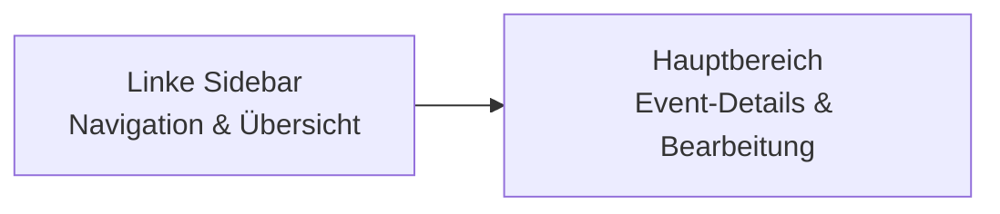

## Was ist der Event Review?

Nach der TOC-Genehmigung erstellt die KI für jeden Event einen vollständigen narrativen Text. Der **Event Review**-Workflow ermöglicht Ihnen, diese Texte zu überprüfen, zu bearbeiten und freizugeben - Event für Event.

## Die Review-Oberfläche

Die Event-Review-Ansicht ist in zwei Hauptbereiche aufgeteilt:




### Linke Sidebar: Navigation & Fortschritt

Die Sidebar ist Ihre zentrale Steuerung:

**Progress-Anzeige**:
- **Zähler**: 12/45 Events freigegeben
- **Fortschrittsbalken**: Visueller Überblick
- **Prozent**: 27% überprüft

**Mini-Graph**:
- Alle Events als anklickbare Knoten
- Farbcodierung nach Status:
  - **Grau**: Noch nicht generiert
  - **Gelb**: Generiert, wartet auf Freigabe
  - **Grün**: Freigegeben
- **Verzweigungen** sind eingerückt dargestellt
- **Branching-Events** haben gelbes Icon
- **Event-Hover**: Zeigt Titel

**Quick Actions**:
- **"Nächster ungenehmigter Event"**: Springt automatisch zum nächsten Event, der noch Freigabe braucht
- **"Szenario validieren"**: Startet finale Validierung (nur wenn alle Events freigegeben)
- **"Alle Probleme beheben"**: Auto-Fix für alle Validierungsprobleme (wenn vorhanden)

### Hauptbereich: Event-Details

Der Hauptbereich zeigt den aktuell ausgewählten Event mit allen Details:

**Header**:
- **Badges**: Event-Typ (Event/Branching), Phase, Quiz-Indikator
- **Titel**: Event-Name aus TOC
- **Zeit**: Zeitstempel (z.B. "Tag 1, 09:30 Uhr")
- **Status-Badge**: "Freigegeben" wenn approved
- **Token-Count**: Zeigt Generierungskosten
- **Undo/Redo**: Bearbeitungen rückgängig machen (Ctrl+Z / Ctrl+Y)

---

## Event-Inhalte verstehen

Jeder generierte Event enthält mehrere Komponenten:

### 1. Zeit & Datum

<Accordion>
  <AccordionItem title="Zeit-Sektion verstehen">
    Zeigt zwei Zeitstempel:

    - **Required Time** (aus TOC): Die Zeit, die im TOC festgelegt wurde
    - **Generated Time** (von KI): Die Zeit, die die KI in den Text schrieb

    **Mismatch-Warnung**: Wenn diese unterschiedlich sind, erscheint ein rotes Badge. Dies kann ein Validierungsproblem sein.

    **Bearbeiten**: Klicken Sie "Bearbeiten", geben Sie die korrigierte Zeit ein (Format: "Tag X, HH:MM Uhr") und speichern Sie.
  </AccordionItem>
</Accordion>

### 2. Generierter Narrativ-Text

Der Hauptinhalt des Events - die immersive Geschichte in 2. Person Singular.

**Merkmale eines guten Narrativs**:
- 500-2.000 Zeichen (je nach Event-Typ)
- **2. Person Singular**: "Du betrittst...", "Dir fällt auf..."
- **Sensorische Details**: Geräusche, visuelle Eindrücke, Gerüche
- **Spannung**: Angemessen für die Phase (Opening vs. Peak)
- **Charaktere**: NPCs agieren konsistent
- **Entscheidungsvorbereitung**: Bei Branching-Events werden Optionen vorbereitet

**Inline-Bearbeitung**:
1. Klicken Sie **"Bearbeiten"**
2. Textarea öffnet sich mit vollständigem Text
3. Bearbeiten Sie direkt
4. **Speichern**: Änderung wird sofort übernommen
5. **Abbrechen**: Verwirft Änderungen

<Tip>
**Auto-Save**: Ihre Änderungen werden alle 2 Sekunden automatisch im Browser gespeichert.
</Tip>

### 3. Charaktere (NPCs)

Liste aller NPCs, die in diesem Event auftreten.

**Prüfung**:
- Sind die NPCs passend für diesen Event?
- Stimmen Namen und Rollen mit vorherigen Events überein?
- Fehlen wichtige Charaktere?

<Note>
NPC-Inkonsistenzen können zu Validierungsfehlern führen. Achten Sie auf kontinuierliche Verwendung über alle Events.
</Note>

### 4. Entscheidungsoptionen (Branching Events)

Bei **Branching Events** zeigt dieser Bereich die 2-4 Optionen:

**Für jede Option**:
- **Option-Buchstabe**: A, B, C, D
- **Text**: Der vollständige Entscheidungstext für den Spieler
- **Strategie-Typ**: z.B. "proactive", "cautious", "aggressive"
- **Leads To**: Event-ID + Titel wohin diese Option führt

**Prüfung**:
- Sind alle Optionen klar und unterscheidbar?
- Führen die Optionen zu den richtigen Events?
- Ist die Strategie-Kategorisierung sinnvoll?

### 5. Assessment (Quiz)

Wenn der Event ein **Assessment** enthält:

**Aufbau**:
- **Topic**: Lernziel-Kategorie
- **Context**: Hinweis oder Einleitung
- **Question**: Die eigentliche Frage
- **Options**: 4 Antwortmöglichkeiten (A, B, C, D)
- **Correct Answer**: Markiert mit grünem ✓
- **Explanation**: Erklärung warum die korrekte Antwort richtig ist

**Bearbeiten**:
1. Klicken Sie **"Bearbeiten"** (im Assessment-Bereich)
2. Modal öffnet sich mit allen Feldern
3. Bearbeiten Sie Topic, Context, Question, Options
4. **Korrekte Antwort markieren**: Klicken Sie auf das ✓ neben der richtigen Option
5. **Speichern**: Übernimmt Änderungen

<Warning>
**Keine Trivial-Fragen**: Assessments sollten echtes Verständnis testen, nicht reines Faktenwissen. Die Erklärung sollte den Lernmoment verstärken.
</Warning>

### 6. Story Flow

Zeigt die Navigation im Szenario-Graph:

- **From**: Woher kommt dieser Event? (nur bei Branch-Events)
- **Leads To**: Wohin führt dieser Event? (bei linearen Events)
- **Branches To**: Alle Verzweigungsziele (bei Branching-Events)

**Klickbar**: Klicken Sie auf Event-Badges um direkt dorthin zu springen.

---

## Validierungsprobleme erkennen & beheben

Während des Reviews kann die KI automatisch Validierungsprobleme erkennen.

### Validierungs-Banner

Wenn Probleme gefunden werden, erscheint ein **gelbes Banner** über dem Event-Inhalt:

**Banner-Inhalt**:
- **Anzahl**: Wie viele Probleme betreffen diesen Event
- **Problem-Liste**: Jedes Problem mit Details

### Problem-Typen

<Tabs>
  <Tab title="Fehler (Error)">
    **Blockiert Export** - muss behoben werden

    **Beispiele**:
    - Zeit fließt rückwärts
    - Event-Referenz existiert nicht
    - NPC-Name ändert sich (z.B. "Dr. Müller" → "Dr. Mueller")
    - Pfad nicht erreichbar

    **Anzeige**: Rotes Badge, roter Rand
  </Tab>

  <Tab title="Warnung (Warning)">
    **Empfohlen zu beheben** - Export möglich aber nicht ideal

    **Beispiele**:
    - Zeit-Sprünge sehr groß (08:00 → 23:00)
    - NPC erscheint ohne Einführung
    - Assessment-Frage zu leicht
    - Event sehr kurz (&lt;300 Zeichen)

    **Anzeige**: Gelbes Badge, gelber Rand
  </Tab>

  <Tab title="Vorschlag (Suggestion)">
    **Optional** - Qualitätsverbesserung

    **Beispiele**:
    - Mehr sensorische Details einfügen
    - Charakterentwicklung vertiefen
    - Spannungsbogen verstärken

    **Anzeige**: Blaues Badge, blauer Rand
  </Tab>
</Tabs>

### Probleme beheben

Für jedes Problem gibt es einen **"Beheben"-Button**:

#### Lokales Beheben (Zeit-Probleme)

Zeit-bezogene Probleme werden **lokal** behoben ohne Backend-Aufruf:

1. System extrahiert korrekte Zeit aus der Vorschlags-Nachricht
2. Zeit wird direkt aktualisiert
3. Problem als "Behoben" markiert (grünes ✓)

**Beispiel**:
```
Problem: "Zeit in Event e7 muss auf 10:20 Uhr geändert werden"
→ System extrahiert "10:20 Uhr" und aktualisiert automatisch
```

#### Backend Micro-Edit (Content-Probleme)

Inhaltliche Probleme erfordern **KI-Regenerierung**:

1. Klicken Sie "Beheben"
2. Backend erhält: Event-Content + Problem-Beschreibung
3. KI macht minimale Änderung (nur das Problem)
4. Text wird aktualisiert
5. Problem als "Behoben" markiert

<Note>
**Micro-Edit vs. Vollständige Regenerierung**: Micro-Edits sind schneller und günstiger (~50% weniger Tokens) als komplette Regenerierung.
</Note>

### Alle Probleme auf einmal beheben

Button **"Alle Probleme beheben"** in der Sidebar:

- Verarbeitet alle erkannten Probleme
- Lokale Fixes zuerst (instant)
- Backend-Fixes nacheinander
- Progress-Anzeige während Verarbeitung

**Dauer**: ~5-10 Sekunden pro Backend-Fix, lokale Fixes instant

---

## Event-Review-Workflow

### Empfohlene Vorgehensweise

<Steps>
  <Step title="Überblick verschaffen">
    Nutzen Sie die **Mini-Graph-Navigation**, um sich einen Überblick über alle Events zu verschaffen:

    - Wie viele Events insgesamt?
    - Wie viele Verzweigungen?
    - Welche Pfade gibt es?
  </Step>

  <Step title="Pfad-basiertes Review">
    Wenn Ihr Szenario Verzweigungen hat, nutzen Sie den **Pfad-Filter**:

    1. Wählen Sie "Pfad 1" aus dem Dropdown
    2. Reviewen Sie alle Events auf diesem Pfad
    3. Wechseln Sie zu "Pfad 2"
    4. Wiederholen

    **Vorteil**: Stellt sicher, dass jeder Pfad eine kohärente Geschichte ergibt.
  </Step>

  <Step title="Event-für-Event Review">
    Für jeden Event:

    1. **Lesen**: Narrativen Text vollständig lesen
    2. **Zeit prüfen**: Ist der Zeitstempel logisch?
    3. **NPCs prüfen**: Stimmen die Charaktere?
    4. **Optionen prüfen** (bei Branching): Sind die Entscheidungen klar?
    5. **Assessment prüfen** (wenn vorhanden): Ist die Frage gut?
    6. **Validierung**: Gibt es Probleme?
  </Step>

  <Step title="Bearbeiten oder Freigeben">
    Drei Optionen:

    - **Freigeben** (grüner Button): Event ist gut, keine Änderungen nötig
    - **Bearbeiten**: Kleine Änderungen inline machen, dann freigeben
    - **Regenerieren**: Größere Probleme → Feedback geben und neu generieren lassen
  </Step>

  <Step title="Probleme beheben">
    Wenn Validierungsprobleme auftreten:

    1. Lesen Sie die Problem-Beschreibung
    2. Entscheiden Sie: Lokal bearbeiten oder "Beheben"-Button
    3. Überprüfen Sie das Ergebnis
    4. Geben Sie Event frei
  </Step>
</Steps>

### Regenerierung mit Feedback

Wenn ein Event substantielle Probleme hat:

1. Klicken Sie **"Änderungen anfordern"** (statt Freigeben)
2. **Feedback-Textfeld** erscheint
3. Beschreiben Sie präzise was geändert werden soll (max. 500 Zeichen)
4. Klicken Sie **"Regenerieren"**

**Feedback-Beispiele**:
```
"Mehr Spannung aufbauen. Der Spieler sollte mehr Druck spüren.
Zeitlimit oder Konsequenzen erwähnen."

"Dr. Müller war in vorherigen Events freundlich - hier ist er
plötzlich feindselig. Bitte Ton konsistent halten."

"Event ist zu kurz. Mehr sensorische Details hinzufügen:
Was hört der Spieler? Was sieht er genau?"

"Assessment-Frage ist zu leicht. Alle Optionen sollten plausibel
klingen, nicht nur eine offensichtlich richtig."
```

<Tip>
**Spezifisch sein**: Je präziser Ihr Feedback, desto besser die Regenerierung. Vermeiden Sie vage Aussagen wie "Bitte besser machen".
</Tip>

### Bulk-Freigabe

Für große Szenarien mit vielen ähnlichen Events:

1. Klicken Sie **"Alle ungenehmigten auswählen"** (oben in Sidebar)
2. **Checkboxen** erscheinen neben jedem Event
3. Wählen Sie gezielt Events aus (oder behalten Sie alle)
4. **Bulk-Actions-Bar** erscheint oben
5. Klicken Sie **"Ausgewählte freigeben"**

**Nutzen**: Spart Zeit bei linearen Abschnitten oder nach erfolgreicher Validierung.

<Warning>
**Vorsicht**: Bulk-Freigabe überspringt detaillierte Einzelprüfung. Nutzen Sie dies nur für Events, die Sie bereits überprüft haben oder die sehr einfach sind.
</Warning>

---

## Bearbeitungshistorie (Undo/Redo)

Alle Ihre Bearbeitungen werden getrackt:

**Tastenkombinationen**:
- **Ctrl+Z** (Windows/Linux) / **Cmd+Z** (Mac): Undo
- **Ctrl+Y** (Windows/Linux) / **Cmd+Y** (Mac): Redo

**Buttons**: Undo/Redo-Buttons oben rechts im Header

**Was wird getrackt**:
- Content-Bearbeitungen (narrativer Text)
- Zeit-Änderungen
- Assessment-Bearbeitungen

**Nicht getrackt**:
- Event-Freigaben
- Regenerierungen

<Note>
**History-Limit**: Die letzten 50 Bearbeitungen werden gespeichert. Ältere werden automatisch entfernt.
</Note>

---

## Navigation & Shortcuts

### Tastenkombinationen

| Tastenkombination | Aktion |
|------------------|--------|
| **Ctrl+Z / Cmd+Z** | Letzte Bearbeitung rückgängig machen |
| **Ctrl+Y / Cmd+Y** | Bearbeitung wiederherstellen |
| **Ctrl+S / Cmd+S** | (Auto-Save, kein manuelles Speichern nötig) |

### Maus-Navigation

- **Event-Knoten klicken** (Sidebar): Springt zu diesem Event
- **Flow-Badges klicken** (Hauptbereich): Springt zu verknüpftem Event
- **"Nächster ungenehmigter"**: Automatische Navigation zum nächsten Event, der Freigabe braucht

---

## Häufige Review-Aufgaben

<Accordion>
  <AccordionItem title="Zeit korrigieren">
    **Problem**: Zeit-Stempel ist falsch oder inkonsistent

    **Lösung**:
    1. Klicken Sie "Bearbeiten" im Zeit-Block
    2. Geben Sie korrekte Zeit ein (Format: "Tag X, HH:MM Uhr")
    3. Speichern

    **Oder**: Nutzen Sie "Beheben"-Button bei automatisch erkannten Zeit-Problemen
  </AccordionItem>

  <AccordionItem title="Text kürzen oder erweitern">
    **Problem**: Event zu lang (&gt;2.000 Zeichen) oder zu kurz (&lt;500 Zeichen)

    **Lösung Option 1** (Kleine Änderung):
    1. Klicken Sie "Bearbeiten" beim Narrativ
    2. Bearbeiten Sie inline
    3. Speichern

    **Lösung Option 2** (Größere Umschreibung):
    1. Klicken Sie "Änderungen anfordern"
    2. Feedback: "Event auf ~1.200 Zeichen kürzen, Fokus auf Haupthandlung"
    3. Regenerieren
  </AccordionItem>

  <AccordionItem title="NPC-Inkonsistenz beheben">
    **Problem**: NPC-Name oder Rolle ändert sich

    **Beispiel**: "Dr. Müller" wird zu "Dr. Mueller" oder "Chefarzt"

    **Lösung**:
    1. Klicken Sie "Änderungen anfordern"
    2. Feedback: "Dr. Müller konsistent verwenden (nicht Mueller oder Chefarzt)"
    3. Regenerieren

    **Oder**: Wenn Validierung das erkennt, nutzen Sie "Beheben"-Button
  </AccordionItem>

  <AccordionItem title="Assessment-Frage verbessern">
    **Problem**: Frage zu leicht, Optionen nicht plausibel, Erklärung fehlt

    **Lösung**:
    1. Klicken Sie "Bearbeiten" im Assessment-Bereich
    2. Bearbeiten Sie Question, Options, Explanation
    3. Markieren Sie korrekte Antwort neu falls nötig
    4. Speichern
  </AccordionItem>

  <AccordionItem title="Entscheidungsoptionen anpassen">
    **Problem**: Option ist unklar, zu ähnlich zu einer anderen, oder führt zum falschen Event

    **Lösung** (Text ändern):
    1. Klicken Sie "Änderungen anfordern"
    2. Feedback: "Option A klarer formulieren: Sollte betonen dass es proaktiv ist"
    3. Regenerieren

    **Lösung** (Falsche Verlinkung):
    → Dies erfordert TOC-Änderung. Gehen Sie zurück zum TOC, lehnen Sie ab mit Feedback.
  </AccordionItem>

  <AccordionItem title="Mehr Spannung hinzufügen">
    **Problem**: Event fühlt sich flach an, keine Dringlichkeit

    **Lösung**:
    1. Klicken Sie "Änderungen anfordern"
    2. Feedback: "Mehr Spannung. Erwähne Zeitdruck, Stakeholder warten auf Entscheidung, Situation verschlechtert sich"
    3. Regenerieren
  </AccordionItem>

  <AccordionItem title="Sensorische Details ergänzen">
    **Problem**: Text ist zu abstrakt, keine Immersion

    **Lösung**:
    1. Klicken Sie "Änderungen anfordern"
    2. Feedback: "Mehr sensorische Details: Was hört der Spieler (Alarme, Gespräche)? Was sieht er (Monitore, Gesichter)?"
    3. Regenerieren
  </AccordionItem>
</Accordion>

---

## Progress & Status-Übersicht

### Fortschrittsbalken

Oben in der Sidebar sehen Sie:
- **X/Y Events**: Anzahl freigegebener Events / Gesamt
- **Prozent**: Visueller Fortschrittsbalken
- **Status-Icons** in Mini-Graph:
  - ⚪ Grau: Nicht generiert
  - 🟡 Gelb: Generiert, wartet auf Freigabe
  - 🟢 Grün: Freigegeben

### Validierungsstatus

Wenn Probleme erkannt wurden:
- **Fehler-Badge**: ❌ 3 Fehler (rot)
- **Warnungs-Badge**: ⚠️ 5 Warnungen (gelb)

**Validierungsindikator** in Mini-Graph:
- Events mit Problemen haben **⚠️-Icon**

---

## Best Practices für effizientes Review

### Pfad-basierter Ansatz

**Für Szenarien mit Verzweigungen**:

1. Filtern Sie nach Pfad 1
2. Reviewen Sie diesen Pfad als zusammenhängende Geschichte
3. Achten Sie auf Story-Kohärenz
4. Wechseln Sie zu Pfad 2
5. Wiederholen

**Vorteil**: Stellt sicher, dass jeder Pfad eine konsistente, qualitativ hochwertige Geschichte ergibt.

### Zwei-Phasen-Review

**Phase 1: Schnell-Check** (alle Events)
- Titel lesen
- Zeitstempel prüfen
- Offensichtliche Probleme markieren
- **Keine Freigabe** in dieser Phase

**Phase 2: Detail-Review** (Event für Event)
- Vollständigen Text lesen
- Inline-Bearbeitungen machen
- Validierungsprobleme beheben
- Freigeben

**Vorteil**: Erkennt strukturelle Probleme früh, bevor Sie Zeit in Details investieren.

### Batch-Bearbeitung

Nutzen Sie Bulk-Freigabe für:
- **Lineare Abschnitte**: Opening-Phase ohne Verzweigungen
- **Nach Validierung**: Wenn automatische Fixes alle Probleme behoben haben
- **Einfache Events**: Kurze Verbindungs-Events ohne komplexe Narrative

<Warning>
**Nicht für**: Branching-Events, Assessment-Events, Peak-Events, Events mit bekannten Problemen
</Warning>

---

## Regenerierungs-Kosten

Jede Regenerierung kostet Tokens:

| Event-Typ | Durchschnittliche Kosten (Sonnet) |
|-----------|-----------------------------------|
| **Einfacher Event** | ~500 Output-Tokens, ~$0.01 |
| **Branching Event** | ~800 Output-Tokens, ~$0.02 |
| **Event + Assessment** | ~1.200 Output-Tokens, ~$0.03 |
| **Micro-Edit Fix** | ~200-300 Output-Tokens, ~$0.005 |

<Tip>
**Kosten-Optimierung**: Nutzen Sie Micro-Edit-Fixes ("Beheben"-Button) statt vollständiger Regenerierung wo möglich - spart ~50-70% Kosten.
</Tip>

---

## Häufige Fehler vermeiden

<Warning>
**Fehler 1**: Events in falscher Reihenfolge reviewen
→ **Lösung**: Folgen Sie der Story-Logik oder nutzen Sie "Nächster ungenehmigter"

**Fehler 2**: Bulk-Freigabe ohne Einzelprüfung
→ **Lösung**: Bulk nur für geprüfte Events nutzen

**Fehler 3**: Zu vage Regenerierungs-Feedback
→ **Lösung**: Spezifisch sein: "Mehr Spannung" → "Zeitdruck erwähnen, 5 Minuten bis Deadline"

**Fehler 4**: Zeit-Inkonsistenzen ignorieren
→ **Lösung**: Immer Zeit-Probleme beheben - sonst Validierungsfehler

**Fehler 5**: NPC-Namen manuell korrigieren statt regenerieren
→ **Lösung**: Lassen Sie KI regenerieren - sonst entstehen neue Inkonsistenzen
</Warning>

---

## Nächste Schritte

Nach vollständiger Event-Freigabe:

<Card
  title="Validierung & Export"
  icon="shield-check"
  href="/scenario-builder/validation-export"
>
  Verstehen Sie die finale Qualitätsprüfung und den Export-Prozess
</Card>
