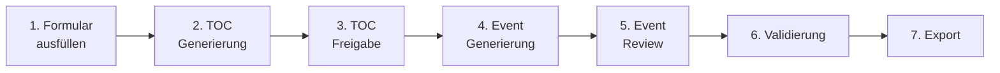

## Was ist der Szenario-Builder?

Der crisisIQ Szenario-Builder ist ein leistungsstarkes Tool zur Erstellung immersiver, verzweigter Krisentrainings-Szenarien für KRITIS- und NIS-2-Bereiche. Mit künstlicher Intelligenz unterstützt, können Sie in wenigen Schritten professionelle Trainingsszenarien erstellen.

## Hauptmerkmale

### KI-Gestützte Generierung
- **Automatische Story-Struktur**: KI erstellt einen kompletten Table of Contents (TOC)
- **Narrative Event-Texte**: Jedes Event wird als immersive Geschichte generiert
- **Intelligente Verzweigungen**: Automatische Erstellung von Entscheidungspunkten
- **Charakterkonsistenz**: NPCs werden über das gesamte Szenario hinweg konsistent dargestellt

### Flexible Szenario-Typen
- **Multi-Hazard Ansatz**: 70% nicht-cyber, 30% cyber Vorfälle
- **6 Hauptkategorien**:
  - Physische Sicherheit (Einbruch, Sabotage, Gewalt)
  - Cyberangriffe (Malware, Ransomware, DDoS)
  - Operative Störungen (Systemausfälle, Lieferprobleme)
  - Umweltereignisse (Naturkatastrophen, Wetter)
  - Lieferkettenprobleme (Zuliefererausfälle, Logistik)
  - Gesundheitskrisen (Pandemien, Krankheitsausbrüche)

### Branching & Entscheidungen
- Mehrere Story-Pfade basierend auf Nutzer-Entscheidungen
- Konvergenzpunkte wo Pfade wieder zusammenlaufen
- Grafische Darstellung der Szenario-Struktur

### Assessments & Lernziele
- Integrierte Quizfragen nach wichtigen Events
- 30 Lernziele über 6 Kategorien
- Automatische Platzierung basierend auf Kontext

### Timeline-Management
- Relative Zeitstempel (z.B. "Tag 1, 08:00 Uhr")
- Automatische Validierung gegen Zeitreisen
- Realistische zeitliche Progression

## Der Erstellungsprozess

Der Szenario-Builder folgt einem 7-stufigen Workflow:

### 1. Formular ausfüllen (5-10 Minuten)
Definieren Sie Ihr Szenario über 6 Sektionen:
- Kontext & Setting
- Der Vorfall
- Szenario-Dynamik
- Lernziele
- Anpassung & Kontext
- Output-Einstellungen

### 2. TOC Generierung
Die KI erstellt eine vollständige Szenario-Struktur mit:
- Alle Events in logischer Reihenfolge
- Verzweigungspunkte und Entscheidungen
- Zeitliche Abfolge
- NPC-Charaktere
- Assessment-Platzierungen

### 3. TOC Freigabe
Überprüfen und genehmigen Sie die Struktur:
- **Graph-Ansicht**: Visualisierung als Netzwerk-Diagramm
- **Listen-Ansicht**: Übersichtliche Auflistung aller Events
- Änderungen anfordern oder akzeptieren

### 4. Event Generierung
Die KI schreibt jeden Event als immersive Geschichte:
- 500-2.000 Zeichen pro Event
- 2. Person Singular Perspektive
- Sensorische Details (Geräusche, Sicht, Gerüche)
- Charakterentwicklung
- Spannungsaufbau

### 5. Event Review & Bearbeitung
Überprüfen und optimieren Sie jeden Event:
- Event-für-Event Navigation
- Inline-Bearbeitung
- Regenerierung einzelner Events
- Timeline-Anpassungen
- Bulk-Freigabe

### 6. Validierung
Automatische Qualitätsprüfung:
- **Fehler** (blockierend): Zeitprobleme, fehlende Referenzen
- **Warnungen**: Potenzielle Probleme
- **Vorschläge**: Stilistische Verbesserungen

### 7. Export
Laden Sie Ihr fertiges Szenario herunter:
- JSON-Format
- Bereit für die Trainingsplattform
- Vollständige Metadaten inklusive

## Features im Detail

### Auto-Save & Resume
- **Automatisches Speichern**: Alle 2 Sekunden im Browser
- **Workflow fortsetzen**: Unterbrochene Arbeit nahtlos weitermachen
- **Versionierung**: Änderungshistorie mit Undo/Redo

### Kosten-Tracking
- Echtzeit-Kostenübersicht
- Token-Nutzung pro Schritt
- Modell-Auswahl (Haiku, Sonnet, Opus)
- Transparente Preisgestaltung

### Mehrsprachigkeit
- **Deutsche Szenarien**: Standardmäßig immersive deutsche Texte
- **Englische Szenarien**: Optional verfügbar
- **UI-Sprache**: Deutsch und Englisch

### Graph-Visualisierung
- Interaktives Netzwerk-Diagramm
- Zoom und Pan
- Event-Details on hover
- Pfad-Highlighting

## Systemanforderungen

### Browser
- Chrome/Edge 90+
- Firefox 88+
- Safari 14+

### Empfohlene Specs
- Bildschirmauflösung: Mindestens 1366x768
- RAM: 4 GB oder mehr
- Stabile Internetverbindung

## Erste Schritte

Bereit anzufangen? Fahren Sie fort mit:

<CardGroup cols={2}>
  <Card
    title="Formular ausfüllen"
    icon="file-lines"
    href="/scenario-builder/form-guide"
  >
    Detaillierte Anleitung zum Ausfüllen aller 6 Sektionen
  </Card>
  <Card
    title="TOC Generierung"
    icon="sitemap"
    href="/scenario-builder/toc-generation"
  >
    Verstehen Sie die Szenario-Struktur-Generierung
  </Card>
  <Card
    title="Event Review"
    icon="pen-to-square"
    href="/scenario-builder/event-review"
  >
    Lernen Sie Events zu überprüfen und zu bearbeiten
  </Card>
  <Card
    title="Best Practices"
    icon="lightbulb"
    href="/scenario-builder/best-practices"
  >
    Tipps für qualitativ hochwertige Szenarien
  </Card>
</CardGroup>

## Benötigen Sie Hilfe?

<Note>
Bei Fragen oder Problemen wenden Sie sich an unser Support-Team unter support@crisisiq.de
</Note>
