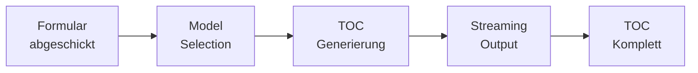

## Was ist der Table of Contents (TOC)?

Der **Table of Contents (TOC)** ist das Rückgrat Ihres Szenarios - eine vollständige Struktur aller Events, Verzweigungen, Charaktere und Assessments. Die KI erstellt diese Struktur basierend auf Ihren Formular-Eingaben.

## TOC Generierung

### Der Generierungsprozess

Nach dem Absenden des Formulars startet die KI-Generierung:



### Was Sie sehen

<Steps>
  <Step title="Streaming-Ansicht">
    Die Generierung erfolgt in Echtzeit. Sie sehen den TOC während er erstellt wird:

    - **Header**: Aktuelle Phase, Modell (Haiku/Sonnet/Opus), geschätzte Kosten
    - **Content-Bereich**: Streaming-Text der KI
    - **Progress**: Geschätzte Zeit bis zur Fertigstellung
    - **Cancel-Button**: Abbrechen jederzeit möglich
  </Step>

  <Step title="Dauer">
    Typische Generierungszeiten:

    - **Klein** (10-15 Events): 30-60 Sekunden
    - **Mittel** (20-30 Events): 60-120 Sekunden
    - **Groß** (40+ Events): 2-4 Minuten
    - **Sehr groß** (80+ Events): 5-8 Minuten
  </Step>

  <Step title="Kosten">
    Sichtbare Kosten-Informationen:

    - **Input Tokens**: Ihr Formular als Token-Count
    - **Output Tokens**: Generierter TOC
    - **Kosten**: In USD (transparent nach Modell)
    - **Modell**: Haiku (~$0.03), Sonnet (~$0.30), Opus (~$0.80)
  </Step>
</Steps>

### Modell-Auswahl

Die KI wählt automatisch das passende Modell basierend auf Komplexität:

| Modell | Geschwindigkeit | Qualität | Kosten | Verwendung |
|--------|----------------|----------|--------|------------|
| **Haiku** | Sehr schnell | Gut | $ | Einfache Szenarien |
| **Sonnet** | Schnell | Sehr gut | $$ | Standard (empfohlen) |
| **Opus** | Langsamer | Exzellent | $$$ | Komplexe Szenarien |

<Note>
**Standard**: Die meisten Szenarien verwenden **Sonnet** - das beste Preis-Leistungs-Verhältnis.
</Note>

### Was die KI erstellt

Der TOC enthält:

**Strukturelle Elemente**:
- Alle Events mit IDs (e1, e2, e3...)
- Event-Nummerierung (1, 2, 3...)
- Titel für jedes Event
- Kurze Zusammenfassung (1-2 Sätze)

**Zeitliche Abfolge**:
- Relative Zeitstempel (z.B. "Tag 1, 08:00 Uhr")
- Zeitliche Progression über alle Pfade
- Realistische Zeitabstände

**Verzweigungslogik**:
- Entscheidungspunkte mit Optionen
- Multiple Pfade (z.B. e4a, e4b, e4c)
- Konvergenzpunkte wo Pfade zusammenlaufen
- Graph-Struktur mit `leads_to` Feldern

**Charaktere (NPCs)**:
- Name, Rolle, Archetyp
- Konsistente Verwendung über Events
- Relevante Positionen im Unternehmen

**Assessments**:
- Platzierung nach wichtigen Events
- Thema (z.B. "Priorisierung unter Druck")
- Quiz-Hinweise

**Metadaten**:
- Phasen-Zuordnung (Opening, Escalation, Peak, Resolution)
- Tension Levels (1-5)
- Sensorische Fokuspunkte

---

## TOC Freigabe-Ansicht

Nach erfolgreicher Generierung gelangen Sie zur Freigabe-Ansicht mit zwei Darstellungsoptionen:

### Graph-Ansicht

Visualisierung des Szenarios als interaktives Netzwerk-Diagramm.

**Features**:
- **Knoten**: Jeder Event ist ein Kreis/Rechteck
- **Kanten**: Pfeile zeigen Verbindungen (was führt wohin)
- **Farben**: Nach Phase oder Pfad gefärbt
- **Interaktiv**:
  - Zoom: Mausrad oder Pinch
  - Pan: Klicken & Ziehen
  - Hover: Zeigt Event-Details
  - Click: Selektiert Event (zeigt volles Detail)

**Layout**:
- Hierarchisch von oben nach unten
- Verzweigungen nebeneinander
- Konvergenzpunkte zusammengeführt

<Tip>
**Navigation**: Nutzen Sie die Graph-Ansicht für einen schnellen Überblick über die Story-Struktur und Pfade.
</Tip>

### Listen-Ansicht

Tabellarische Auflistung aller Events.

**Spalten**:
- **Event ID** (e1, e2, etc.)
- **#** (Event-Nummer)
- **Titel**
- **Phase** (Opening, Escalation, Peak, Resolution)
- **Zeit** (Tag X, HH:MM Uhr)
- **Zusammenfassung** (1-2 Sätze)
- **Leads To** (Wohin führt das Event)
- **Assessment** (✓ wenn vorhanden)

**Sortierung & Filter**:
- Sortierbar nach allen Spalten
- Filter nach Phase
- Suche nach Text in Titel/Zusammenfassung

<Tip>
**Detailprüfung**: Nutzen Sie die Listen-Ansicht für systematische Überprüfung der Logik und Timeline.
</Tip>

---

## TOC Bewerten & Entscheiden

Sie haben drei Optionen:

### 1. Akzeptieren

**Wenn**: Der TOC erfüllt Ihre Erwartungen

**Action**: Klicken Sie "TOC akzeptieren und mit Event-Generierung fortfahren"

**Result**: Wechsel zur Event-Generierungs-Ansicht

### 2. Ablehnen & Neu generieren

**Wenn**: Der TOC passt nicht oder hat Probleme

**Action**:
1. Klicken Sie "TOC ablehnen"
2. **Feedback-Modal** öffnet sich
3. Beschreiben Sie, was geändert werden soll (max. 500 Zeichen)

**Feedback-Beispiele**:
```
"Zu wenig Verzweigungen. Bitte mehr Entscheidungspunkte
einbauen - mindestens 5."

"Die Timeline ist zu komprimiert. Stretch das Szenario
über 3 Tage statt nur 1 Tag."

"Mehr NPCs aus Management-Ebene einbeziehen. Aktuell
nur operative Rollen vorhanden."

"Zu linearer Aufbau. Mehr unerwartete Wendungen und
parallele Ereignisstränge."
```

<Note>
**Iterativ**: Sie können den TOC mehrfach regenerieren. Jede Iteration kostet zusätzliche Tokens.
</Note>

### 3. Abbrechen

**Wenn**: Sie fundamental neu starten möchten

**Action**: Zurück zum Formular, Eingaben anpassen

---

## Qualitätsprüfung des TOC

Bevor Sie akzeptieren, überprüfen Sie:

### Struktur-Check

<Checklist>
  - [ ] **Event-Anzahl** passt zur Komplexität (10-15 für kurz, 30-50 für mittel, 80+ für lang)
  - [ ] **Verzweigungen** entsprechen Ihrer Angabe (±1 ist ok)
  - [ ] **Phasen** sind ausgewogen verteilt (nicht 90% Opening, 10% Rest)
  - [ ] **Anfang & Ende** sind klar definiert (e1 ist Start, klar definiertes Ende)
</Checklist>

### Timeline-Check

<Checklist>
  - [ ] **Zeit fließt vorwärts** auf allen Pfaden
  - [ ] **Zeitsprünge** sind realistisch (nicht von 08:00 zu 23:00 ohne Erklärung)
  - [ ] **Gesamtdauer** passt zum Szenario (Minor = Stunden, Catastrophic = Tage/Wochen)
  - [ ] **Konvergenz-Timing** ist konsistent
</Checklist>

### Inhaltlicher Check

<Checklist>
  - [ ] **Event-Titel** sind spezifisch und beschreibend
  - [ ] **Zusammenfassungen** geben klaren Story-Überblick
  - [ ] **NPCs** haben sinnvolle Rollen für den Kontext
  - [ ] **Verzweigungen** ergeben narrative Sinn (echte Entscheidungen, nicht willkürlich)
  - [ ] **Assessments** sind an sinnvollen Stellen platziert (nach Lernmomenten)
</Checklist>

### Logik-Check

<Checklist>
  - [ ] **Keine Orphaned Events** (Events ohne Vorgänger außer e1)
  - [ ] **Keine Dead Ends** (Events die nirgendwo hinführen außer End-Events)
  - [ ] **Pfade erreichbar** (jeder Verzweigungspfad ist vom Start erreichbar)
  - [ ] **Konvergenz macht Sinn** (Pfade laufen dort zusammen, wo es narrativ passt)
</Checklist>

---

## Häufige TOC-Probleme & Lösungen

<Accordion>
  <AccordionItem title="Zu wenige Events">
    **Problem**: TOC hat nur 8 Events, Sie erwarteten 30+

    **Ursachen**:
    - Zu wenig Verzweigungspunkte gewählt
    - Niedriger Schweregrad
    - Einfache Komplexität

    **Lösung**: Regenerieren mit Feedback:
    ```
    "Bitte deutlich mehr Events generieren - mindestens 25.
    Mehr Detail in der Eskalationsphase und längere Resolution."
    ```
  </AccordionItem>

  <AccordionItem title="Timeline-Inkonsistenzen">
    **Problem**: Zeit springt zurück oder unrealistische Sprünge

    **Beispiel**: e5 ist bei Tag 1, 14:00; e6 ist bei Tag 1, 10:00

    **Lösung**: Regenerieren mit Feedback:
    ```
    "Timeline korrigieren - Zeit muss immer vorwärts fließen.
    Realistische Zeitabstände zwischen Events einhalten."
    ```
  </AccordionItem>

  <AccordionItem title="Zu linear">
    **Problem**: Trotz 5 angeforderten Verzweigungen ist das Szenario fast linear

    **Lösung**: Regenerieren mit Feedback:
    ```
    "Deutlich mehr Verzweigungen einbauen. Jede Verzweigung
    sollte zu signifikant unterschiedlichen Story-Pfaden führen,
    nicht nur zu kosmetischen Varianten."
    ```
  </AccordionItem>

  <AccordionItem title="Unrealistische Charaktere">
    **Problem**: NPCs passen nicht zum Setting oder haben unpassende Rollen

    **Beispiel**: "Captain der Weltraumstation" in Krankenhaus-Szenario

    **Lösung**: Regenerieren mit Feedback:
    ```
    "NPCs an realistisches Krankenhaus-Setting anpassen.
    Typische Rollen: Ärztlicher Direktor, Pflegeleitung,
    IT-Verantwortlicher, Verwaltungsdirektor."
    ```
  </AccordionItem>

  <AccordionItem title="Assessments fehlen oder falsch platziert">
    **Problem**: Keine Assessments trotz 5 Lernzielen, oder an unpassenden Stellen

    **Lösung**: Regenerieren mit Feedback:
    ```
    "Für jedes der 5 Lernziele ein Assessment einbauen.
    Platzierung nach Events wo das Lernziel praktisch angewendet wurde."
    ```
  </AccordionItem>
</Accordion>

---

## Cost Awareness

### Typische TOC-Kosten

| Szenario-Größe | Events | Tokens (Out) | Kosten (Sonnet) |
|----------------|--------|--------------|-----------------|
| Klein | 10-15 | ~3K | ~$0.05 |
| Mittel | 20-30 | ~8K | ~$0.15 |
| Groß | 40-60 | ~15K | ~$0.30 |
| Sehr groß | 80-100 | ~25K | ~$0.50 |
| Extrem | 150+ | ~40K | ~$0.80 |

<Warning>
**Regenerierungs-Kosten**: Jede Regenerierung kostet ähnlich viel wie die initiale Generierung. Bei 3 Iterationen verdr eifachen sich die TOC-Kosten.
</Warning>

<Tip>
**Empfehlung**: Investieren Sie Zeit in präzises Formular-Ausfüllen (Sektion 5!) um Regenerierungen zu minimieren.
</Tip>

---

## Performance-Tipps

### Schnellere Generierung
- **Wählen Sie Haiku** für einfache Szenarien (manuelle Modell-Auswahl falls verfügbar)
- **Reduzieren Sie Events** durch weniger Verzweigungen
- **Niedriger Schweregrad** = weniger Komplexität = schneller

### Bessere Qualität
- **Nutzen Sie Sonnet/Opus** für wichtige Trainings
- **Detaillierte Formular-Eingaben** in Sektion 5 → besserer Kontext
- **Klare Lernziele** → fokussiertere Struktur

---

## Nächste Schritte

Nach TOC-Akzeptanz:

<Card
  title="Event Generierung & Review"
  icon="pen-to-square"
  href="/scenario-builder/event-review"
>
  Verstehen Sie, wie die KI volle narrative Event-Texte erstellt und wie Sie diese reviewen
</Card>
