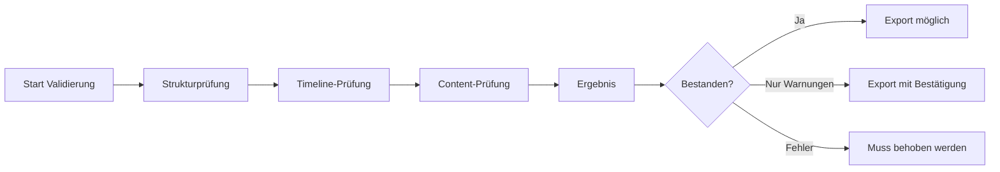

## Was ist die Validierung?

Die **Validierung** ist die letzte Qualitätssicherung vor dem Export. Das System prüft Ihr gesamtes Szenario auf strukturelle, logische und inhaltliche Probleme.

<Note>
**Zeitpunkt**: Die Validierung wird automatisch ausgelöst, sobald Sie alle Events freigegeben haben. Sie können sie auch manuell über den Button "Szenario validieren" starten.
</Note>

---

## Der Validierungsprozess

### Automatische Prüfung

Nach Klick auf "Szenario validieren":



**Dauer**: 10-30 Sekunden (abhängig von Szenario-Größe)

**Was wird geprüft**:
<Tabs>
  <Tab title="Struktur">
    - Alle Event-IDs sind eindeutig
    - Keine verwaisten Events (außer Start-Event)
    - Keine toten Enden (außer End-Events)
    - Alle Referenzen existieren (leads_to, from_option)
    - Branching-Struktur ist vollständig
    - Assessment-Struktur ist valide
  </Tab>

  <Tab title="Timeline">
    - Zeit fließt vorwärts auf allen Pfaden
    - Keine Zeitsprünge rückwärts
    - Zeitabstände sind realistisch
    - Konvergenzpunkte sind zeitlich konsistent
    - Format ist einheitlich (z.B. immer "Tag X, HH:MM Uhr")
  </Tab>

  <Tab title="Content">
    - NPCs haben konsistente Namen
    - Charaktere werden eingeführt vor erster Verwendung
    - Event-Längen sind angemessen (500-2.000 Zeichen)
    - Assessments haben korrekte Antworten markiert
    - Branching-Optionen sind eindeutig
    - Phasen-Zuordnung passt zum Content
  </Tab>

  <Tab title="Logik">
    - Alle Pfade vom Start erreichbar
    - Alle Pfade führen zu einem Ende
    - Verzweigungslogik ergibt Sinn
    - Keine zirkulären Referenzen
    - Assessment-Platzierung ist sinnvoll
  </Tab>
</Tabs>

### Validierungs-Ergebnis

Nach Abschluss sehen Sie eines von drei Ergebnissen:

#### ✅ Bestanden (Passed)

<Card>
  <div style={{textAlign: "center", padding: "2rem"}}>
    <div style={{fontSize: "4rem"}}>✅</div>
    <h3>Validierung bestanden!</h3>
    <p>Ihr Szenario hat alle Qualitätsprüfungen bestanden.</p>
  </div>
</Card>

**Bedeutet**:
- Keine Fehler gefunden
- Keine Warnungen gefunden
- Szenario ist export-bereit

**Nächster Schritt**: Direkter Export möglich

---

#### ⚠️ Warnungen (Warnings)

**Status-Banner** (gelb):
```
⚠️ Warnungen gefunden
5 Warnung(en) gefunden. Sie können trotzdem exportieren.
```

**Bedeutet**:
- Keine blockierenden Fehler
- Empfohlene Verbesserungen gefunden
- **Export ist möglich**, aber Qualität könnte besser sein

**Typische Warnungen**:
- Event sehr kurz (<300 Zeichen)
- Event sehr lang (>2.500 Zeichen)
- Großer Zeitsprung (>8 Stunden ohne Erklärung)
- NPC erscheint ohne vorherige Erwähnung
- Assessment-Frage möglicherweise zu leicht
- Wenig sensorische Details

**Optionen**:
1. **"Probleme beheben"**: Auto-Fix für Warnungen
2. **"Trotzdem exportieren"**: Bestätigung erforderlich
3. **Zurück zu Review**: Manuelle Bearbeitung

---

#### ❌ Fehler (Errors)

**Status-Banner** (rot):
```
❌ Validierung fehlgeschlagen
3 Fehler gefunden, die vor dem Export behoben werden müssen.
```

**Bedeutet**:
- Blockierende Probleme gefunden
- **Export nicht möglich**
- Fehler müssen behoben werden

**Typische Fehler**:
- Zeit fließt rückwärts (z.B. e5: 10:00 Uhr → e6: 09:00 Uhr)
- Event-Referenz existiert nicht (leads_to: "e99" aber e99 existiert nicht)
- NPC-Name ändert sich (e3: "Dr. Müller" → e7: "Dr. Mueller")
- Verwaister Event (kein Pfad führt zu diesem Event)
- Toter Pfad (Event führt nirgendwo hin)
- Assessment ohne korrekte Antwort
- Branching-Option führt zu nicht-existierendem Event

**Pflicht**: Beheben Sie alle Fehler vor Export

---

## Validierungsprobleme verstehen

### Problem-Darstellung

Jedes Problem wird als **Karte** angezeigt:

**Karten-Aufbau**:
- **Severity-Badge**: ERROR | WARNING | SUGGESTION (farbcodiert)
- **Type-Badge**: Timeline | Continuity | Character | Structure
- **Beschreibung**: Was ist das Problem?
- **Vorschlag**: Wie beheben? (wenn verfügbar)
- **Betroffene Events**: Klickbare Event-IDs

**Beispiel-Karte**:
```
┌─────────────────────────────────────────┐
│ [ERROR] [Timeline]                      │
│                                         │
│ Zeit fließt rückwärts zwischen e5       │
│ und e6. Event e5 hat 10:20 Uhr, aber   │
│ e6 hat 09:15 Uhr.                       │
│                                         │
│ 💡 Vorschlag: Zeit in e6 auf 10:25 Uhr  │
│    oder später ändern.                  │
│                                         │
│ 🔗 Betroffene Events: [e5] [e6]         │
└─────────────────────────────────────────┘
```

### Problem-Kategorien

<Accordion>
  <AccordionItem title="Timeline-Probleme">
    **Zeit fließt rückwärts**:
    - Event A: 10:00 Uhr → Event B: 09:00 Uhr
    - **Fix**: Zeit in Event B auf 10:05 Uhr oder später ändern

    **Unrealistischer Zeitsprung**:
    - Event A: 08:00 Uhr → Event B: 23:00 Uhr (15 Stunden)
    - **Fix**: Zwischenevent hinzufügen oder Zeit anpassen

    **Konvergenz-Inkonsistenz**:
    - Pfad 1 erreicht Konvergenz bei Tag 2, 10:00
    - Pfad 2 erreicht Konvergenz bei Tag 1, 16:00
    - **Fix**: Zeitstempel angleichen
  </AccordionItem>

  <AccordionItem title="Continuity-Probleme">
    **Verwaister Event**:
    - Kein leads_to führt zu diesem Event
    - **Fix**: Verbindung herstellen oder Event entfernen

    **Toter Pfad**:
    - Event führt nirgendwo hin (aber ist kein End-Event)
    - **Fix**: leads_to hinzufügen

    **Fehlende Referenz**:
    - Event verweist auf e99, aber e99 existiert nicht
    - **Fix**: Korrekte Event-ID verwenden
  </AccordionItem>

  <AccordionItem title="Character-Probleme">
    **NPC-Name ändert sich**:
    - Event 3: "Dr. Müller"
    - Event 7: "Dr. Mueller" oder "Chefarzt"
    - **Fix**: Konsistenten Namen verwenden

    **NPC ohne Einführung**:
    - "Frau Schmidt" erscheint in Event 15, wurde nie erwähnt
    - **Fix**: Einführung in früheren Event oder in Event 15

    **NPC-Rolle inkonsistent**:
    - Event 5: "IT-Leiter Hans Meier"
    - Event 12: "Sicherheitsbeauftragter Hans Meier"
    - **Fix**: Rolle konsistent halten
  </AccordionItem>

  <AccordionItem title="Content-Probleme">
    **Event zu kurz**:
    - <300 Zeichen
    - **Fix**: Event erweitern mit mehr Details

    **Event zu lang**:
    - >2.500 Zeichen
    - **Fix**: Event aufteilen oder kürzen

    **Assessment-Problem**:
    - Keine korrekte Antwort markiert
    - Mehrere korrekte Antworten markiert
    - Optionen nicht unterscheidbar
    - **Fix**: Assessment bearbeiten
  </AccordionItem>
</Accordion>

---

## Probleme beheben

### Auto-Fix (Empfohlen)

**Button**: "Alle Probleme beheben" (unten im Footer)

**Was passiert**:
1. System analysiert jedes Problem
2. **Lokale Fixes** (instant):
   - Zeit-Korrekturen
   - Format-Angleichungen
3. **Backend Micro-Edits** (~5-10 Sek pro Problem):
   - NPC-Namen korrigieren
   - Event erweitern/kürzen
   - Content-Anpassungen

**Fortschrittsanzeige**:
```
Behebe Probleme... 3/7 behoben
├─ ✅ Zeit in e6 korrigiert
├─ ✅ Zeit in e12 korrigiert
├─ ✅ NPC-Name in e15 korrigiert
└─ ⏳ Event e23 wird erweitert...
```

<Tip>
**Effizient & günstig**: Auto-Fix nutzt Micro-Edits statt vollständiger Regenerierung. Spart ~70% Tokens und ist 5x schneller.
</Tip>

### Manuelle Behebung

Wenn Sie lieber selbst Hand anlegen:

1. **Klicken** Sie auf Event-ID in der Problem-Karte
2. Sie werden zu Event-Review zurückgeleitet
3. **Bearbeiten** Sie den Event manuell
4. **Zurück** zur Validierung
5. **"Erneut validieren"** klicken

**Wann manuell**:
- Sie möchten größere inhaltliche Änderungen
- Auto-Fix-Ergebnis ist nicht zufriedenstellend
- Problem erfordert kreative Lösung

---

## Export-Prozess

### Wann ist Export möglich?

<Checklist>
  - [ ] Alle Events sind freigegeben
  - [ ] Validierung wurde durchgeführt
  - [ ] **Keine Fehler** vorhanden (Warnungen sind ok mit Bestätigung)
</Checklist>

### Export starten

**Button**: "Szenario exportieren" (grün, unten im Footer)

**Bei Warnungen**: Bestätigungs-Dialog erscheint:
```
┌──────────────────────────────────────┐
│ Mit Warnungen exportieren?           │
│                                      │
│ Ihr Szenario hat 5 Warnung(en).     │
│ Möchten Sie trotzdem exportieren?   │
│                                      │
│  [Abbrechen]  [Ja, exportieren]     │
└──────────────────────────────────────┘
```

### Export-Format

**Dateiname**: `scenario_[title]_[timestamp].json`

**Beispiel**: `scenario_ransomware-klinik_2025-01-15T14-23-11.json`

**Dateiinhalt**:
```json
{
  "metadata": {
    "id": "uuid-v4",
    "title": "Ransomware-Angriff auf Klinikum",
    "version": "1.0.0",
    "created_at": "2025-01-15T14:23:11Z",
    "creator": "user@example.com",
    "language": "de"
  },
  "settings": {
    "industry": "Healthcare",
    "organization_type": "Hospital",
    "organization_size": "Large",
    "incident_type": "Ransomware Attack",
    "severity": "Major",
    "duration": "3 days"
  },
  "learning_objectives": [
    {
      "id": "lo1",
      "category": "Decision Making",
      "description": "Entscheidungen unter Zeitdruck treffen"
    }
  ],
  "events": [
    {
      "event_id": "e1",
      "event_number": 1,
      "title": "Erste Warnsignale",
      "phase": "Opening",
      "time_marker": "Tag 1, 08:00 Uhr",
      "content": "Du betrittst...",
      "npcs": ["Dr. Müller", "IT-Leiter Schmidt"],
      "tension_level": 1,
      "leads_to": "e2"
    },
    ...
  ],
  "assessments": [
    {
      "assessment_id": "a1",
      "after_event": "e5",
      "topic": "Priorisierung unter Druck",
      "question": "Welche Maßnahme...",
      "options": [...],
      "correct_answer": "opt_a",
      "explanation": "..."
    }
  ],
  "validation": {
    "passed": true,
    "issues": [],
    "validated_at": "2025-01-15T14:22:45Z"
  },
  "usage": {
    "toc_generation": {
      "tokens": 8234,
      "cost_usd": 0.15
    },
    "event_generation": {
      "tokens": 45678,
      "cost_usd": 0.89
    },
    "total_tokens": 53912,
    "total_cost_usd": 1.04
  }
}
```

### Was wird exportiert?

**Komplett enthalten**:
- Alle Events mit vollständigen narrativen Texten
- Alle Branching-Optionen
- Alle Assessments
- NPC-Definitionen
- Timeline-Struktur
- Metadata & Settings
- Validierungs-Status
- Token & Kosten-Tracking

**Nicht enthalten**:
- Review-Notizen (nur lokal im Browser)
- Bearbeitungshistorie
- Temporäre Zwischenstände

---

## Nach dem Export

### Datei nutzen

Die exportierte JSON-Datei kann:

1. **Import in Trainingsplattform**: Direkt in crisisIQ Trainingsmodul hochladen
2. **Archivierung**: Als Backup speichern
3. **Versionsmanagement**: Mit anderen Versionen vergleichen
4. **Weitergabe**: An Kollegen oder Trainer senden

### Erneut bearbeiten

Sie können jederzeit zurück zum Builder:

1. Öffnen Sie Builder erneut
2. **Auto-Resume**: System erkennt gespeicherten Workflow
3. Wählen Sie "Fortsetzen"
4. Sie sind genau dort, wo Sie aufgehört haben

<Note>
**LocalStorage**: Ihre Arbeit wird automatisch im Browser gespeichert bis Sie explizit "Neues Szenario" starten.
</Note>

---

## Validierungs-Kosten

Die Validierung selbst ist **kostenpflichtig** (KI-basierte Prüfung):

| Szenario-Größe | Validierungs-Tokens | Kosten (Sonnet) |
|----------------|---------------------|-----------------|
| Klein (10-15 Events) | ~2.000 | ~$0.04 |
| Mittel (20-30 Events) | ~4.000 | ~$0.08 |
| Groß (40-60 Events) | ~8.000 | ~$0.15 |
| Sehr groß (80-100 Events) | ~15.000 | ~$0.30 |

**Auto-Fix-Kosten** (zusätzlich):
- Pro lokalem Fix: $0 (instant)
- Pro Backend Micro-Edit: ~$0.005-0.01

<Tip>
**Mehrfache Validierung**: Sie können beliebig oft validieren. Jede Validierung kostet erneut Tokens. Nutzen Sie Auto-Fix beim ersten Mal, um mehrfaches Validieren zu vermeiden.
</Tip>

---

## Häufige Validierungsprobleme & Lösungen

<Accordion>
  <AccordionItem title="Zeit-Inkonsistenzen">
    **Problem**: "Zeit fließt rückwärts zwischen e12 und e13"

    **Ursache**: Manuelle Bearbeitung oder Regenerierung hat Zeit nicht aktualisiert

    **Lösung**:
    1. **Auto-Fix nutzen** (schnellste Methode)
    2. **Oder manuell**: Gehen Sie zu Event e13, klicken "Bearbeiten" bei Zeit, korrigieren

    **Prävention**: Bei manuellen Zeitänderungen immer nachfolgende Events prüfen
  </AccordionItem>

  <AccordionItem title="Verwaiste Events nach TOC-Änderung">
    **Problem**: "Event e7b ist nicht erreichbar"

    **Ursache**: TOC wurde regeneriert, alte Event-IDs entfernt aber Events nicht gelöscht

    **Lösung**:
    → Zurück zum TOC, erneut ablehnen und regenerieren mit korrekter Struktur
    → Oder: Im Event-Review, betroffenen Event mit korrekter leads_to-Referenz verknüpfen

    **Prävention**: Nach TOC-Regenerierung immer kompletten Review neu durchführen
  </AccordionItem>

  <AccordionItem title="NPC-Name-Varianten">
    **Problem**: "Charakter-Name inkonsistent: 'Dr. Müller' vs. 'Dr. Mueller' vs. 'Chefarzt'"

    **Ursache**: KI verwendet Varianten, besonders nach Regenerierungen

    **Lösung**:
    1. **Auto-Fix nutzen** - erkennt automatisch den häufigsten Namen und korrigiert
    2. **Oder manuell**: Alle betroffenen Events einzeln regenerieren mit Feedback "Bitte 'Dr. Müller' verwenden"

    **Prävention**: Im Formular (Sektion 5) explizit NPCs mit vollständigen Namen definieren
  </AccordionItem>

  <AccordionItem title="Konvergenz-Zeit-Mismatch">
    **Problem**: "Konvergenzpunkt e15 wird von Pfad A bei 10:00 Uhr und Pfad B bei 14:00 Uhr erreicht"

    **Ursache**: Verzweigungspfade haben unterschiedliche Zeitprogressionen

    **Lösung**:
    1. Entscheiden Sie: Sollen beide Pfade zur gleichen Zeit konvergieren?
    2. **Option A** (gleiche Zeit): Einen Pfad zeitlich anpassen
    3. **Option B** (bewusst unterschiedlich): Konvergenz-Event auf "flexiblen Zeitpunkt" setzen (z.B. "Tag 2, nachmittags")

    **Prävention**: Beim TOC-Approval Konvergenzpunkte auf Zeit-Konsistenz prüfen
  </AccordionItem>

  <AccordionItem title="Assessment ohne korrekte Antwort">
    **Problem**: "Assessment nach e12 hat keine als korrekt markierte Antwort"

    **Ursache**: KI hat correct_answer-Feld nicht gesetzt oder falsche ID verwendet

    **Lösung**:
    1. Gehen Sie zu Event e12
    2. Klicken Sie "Bearbeiten" im Assessment-Bereich
    3. Klicken Sie ✓ neben der richtigen Option
    4. Speichern

    **Prävention**: Bei Assessment-Events immer korrekte Antwort visuell prüfen (grünes ✓)
  </AccordionItem>
</Accordion>

---

## Validierungs-Checkliste

Vor dem Export, stellen Sie sicher:

### Strukturelle Integrität

<Checklist>
  - [ ] Alle Events haben eindeutige IDs
  - [ ] Start-Event (e1) vorhanden
  - [ ] Mindestens ein End-Event vorhanden
  - [ ] Alle leads_to Referenzen existieren
  - [ ] Branching-Events haben 2-4 Optionen
  - [ ] Alle Options führen zu existierenden Events
</Checklist>

### Timeline-Konsistenz

<Checklist>
  - [ ] Zeit fließt vorwärts auf allen Pfaden
  - [ ] Keine Zeitsprünge >12 Stunden ohne Erklärung
  - [ ] Konvergenzpunkte sind zeitlich konsistent (±1 Stunde ok)
  - [ ] Format ist einheitlich (z.B. "Tag X, HH:MM Uhr")
  - [ ] Gesamtdauer passt zum Schweregrad
</Checklist>

### Content-Qualität

<Checklist>
  - [ ] Events sind 500-2.000 Zeichen lang
  - [ ] NPCs haben konsistente Namen über alle Events
  - [ ] Alle NPCs wurden eingeführt vor erster Verwendung
  - [ ] Assessments haben korrekte Antworten markiert
  - [ ] Branching-Optionen sind klar unterscheidbar
  - [ ] Sensorische Details in immersiven Events
</Checklist>

### Logische Kohärenz

<Checklist>
  - [ ] Jeder Pfad ist vom Start erreichbar
  - [ ] Jeder Pfad führt zu einem Ende
  - [ ] Verzweigungen ergeben narrativen Sinn
  - [ ] Assessments sind nach relevanten Events platziert
  - [ ] Phasen-Zuordnung passt zum Spannungsbogen
</Checklist>

---

## Troubleshooting

### "Validierung läuft ewig"

**Problem**: Validierung hängt bei "Validiere..." >2 Minuten

**Ursache**: Netzwerkproblem oder Backend-Überlastung

**Lösung**:
1. Warten Sie weitere 2 Minuten
2. Seite neu laden (F5) - Auto-Resume greift
3. Erneut validieren

### "Auto-Fix funktioniert nicht"

**Problem**: "Alle Probleme beheben" gedrückt, aber Fehler bleiben

**Ursache**: Problem erfordert strukturelle Änderung (nicht nur Content)

**Lösung**: Manuell beheben:
- **Verwaiste Events**: Verbindung im TOC herstellen
- **Fehlende Referenzen**: Event-IDs im TOC korrigieren
- **Konvergenz-Probleme**: Timeline im TOC anpassen

### "Export-Button ist ausgegraut"

**Ursache**: Fehler vorhanden (Warnungen blockieren nicht)

**Lösung**:
1. Scrollen Sie nach oben zu den Error-Karten
2. Beheben Sie alle ERRORS
3. Re-validieren
4. Export sollte nun möglich sein

---

## Best Practices

### Validierung früh & oft

<Tip>
**Nicht erst am Ende**: Validieren Sie bereits während des Event-Reviews alle 10-15 Events. So erkennen Sie Probleme früh.
</Tip>

### Auto-Fix bevorzugen

Auto-Fix ist:
- ✅ Schneller (5-10 Sek vs. 2-3 Min manuell)
- ✅ Günstiger (~50-70% Tokens gespart)
- ✅ Konsistenter (einheitlicher Stil)

**Nutzen Sie manuell nur wenn**:
- Auto-Fix-Ergebnis nicht zufriedenstellend
- Strukturelle Änderungen nötig
- Kreative Lösung gewünscht

### Warnungen ernst nehmen

<Warning>
Warnungen sind **nicht blockierend**, aber sie beeinflussen die Qualität:
- Events <500 Zeichen fühlen sich abrupt an
- Große Zeitsprünge brechen Immersion
- Fehlende NPC-Einführungen verwirren Spieler

**Empfehlung**: Beheben Sie Warnungen für professionelle Trainings.
</Warning>

### Export-Backups

Erstellen Sie mehrere Export-Versionen:
1. **v1.0**: Nach erster erfolgreicher Validierung
2. **v1.1**: Nach Warnung-Fixes
3. **v2.0**: Nach inhaltlichen Verbesserungen

**Vorteil**: Sie können jederzeit zu einer früheren Version zurück.

---

## Nächste Schritte

Nach erfolgreichem Export:

<CardGroup cols={2}>
  <Card
    title="Best Practices"
    icon="lightbulb"
    href="/scenario-builder/best-practices"
  >
    Lernen Sie Tipps & Tricks für qualitativ hochwertige Szenarien
  </Card>
  <Card
    title="Zurück zur Übersicht"
    icon="home"
    href="/scenario-builder/overview"
  >
    Zurück zur Scenario Builder Übersicht
  </Card>
</CardGroup>
